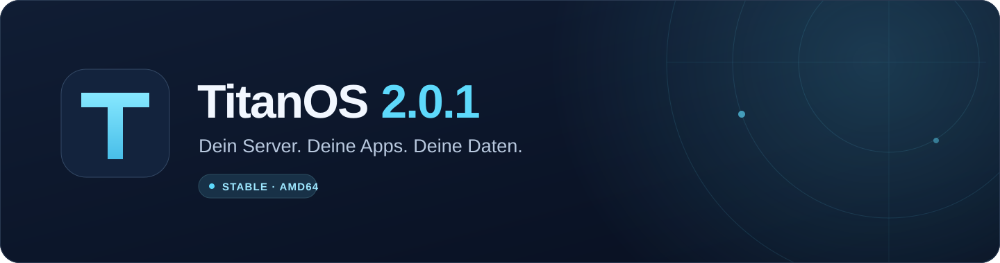
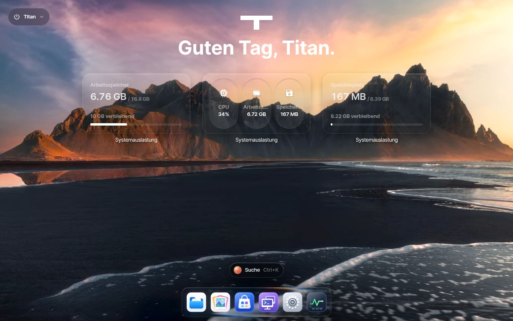

  

<h1 align="center">TitanOS 2.0.3 · Stable</h1>

  Ein Zuhause für deine Dateien, Apps und virtuellen Maschinen. 
  Auf deinem Server, direkt im Browser.

  <a href="https://github.com/ra5on/TitanOS/releases/download/v2.0.3/titan-2.0.3.img.xz"><strong>IMG herunterladen</strong></a>
  · <a href="https://github.com/ra5on/TitanOS/releases/tag/v2.0.3">Release &amp; Prüfsummen</a>
  · <a href="https://github.com/ra5on/TitanOS/issues">Support</a>

Die Downloads für 2.0.3 stehen nach erfolgreicher Image-Prüfung und
Veröffentlichung bereit.

## Dein Server im Überblick

TitanOS verbindet eine deutsche Oberfläche mit einem übersichtlichen Desktop.
Im Dock erreichst du Dateien, Foto's, den App-Store, virtuelle Maschinen und
Einstellungen. Oben links findest du das Systemmenü: Abmelden, Neustarten und
Herunterfahren werden jeweils mit **Ja / Nein** bestätigt.

| Bereich | Was du damit machen kannst |
| --- | --- |
| Dateien & Foto's | Dateien verwalten und Fotos ansehen |
| App-Store & Docker | Apps installieren und Container verwalten |
| Virtuelle Maschinen | Weitere Betriebssysteme auf deinem Server betreiben |
| Speicher & Benutzer | Laufwerke einrichten und Zugänge verwalten |
| Einstellungen | Netzwerk, Backups und Systemupdates konfigurieren |

Für virtuelle Maschinen wählst du **NAT**, **Host-only** oder **Heimnetz (Bridge)**.
Fehlt eine passende Bridge, kann TitanOS sie über einen kabelgebundenen
Netzwerkanschluss automatisch einrichten. Die [VM-Netzwerkanleitung](docs/MACHINE-NETWORKS.md)
erklärt die Auswahl, den Verbindungsschutz und den Wechsel nach der Installation.
Das Dock verwendet wieder die ursprünglichen Icons des Forks.

## Ein Blick auf TitanOS

Die Aufnahmen zeigen die gebaute Oberfläche von TitanOS 2.0.1 mit dem echten
Backend in einer isolierten Testumgebung. Die Aufnahmen enthalten noch die
damaligen Titan-Dock-Icons; 2.0.3 stellt die ursprünglichen Fork-Icons wieder her.
[Details zu den Aufnahmen](docs/images/README.md).

| Dateien | Einstellungen |
| --- | --- |
|  |  |

## Installieren

Für einen x86-64-Rechner empfehlen wir **8 GB RAM**, eine **SSD ab 64 GB** und
**UEFI mit deaktiviertem Secure Boot**.

1. Lade [titan-2.0.3.img.xz](https://github.com/ra5on/TitanOS/releases/download/v2.0.3/titan-2.0.3.img.xz) herunter. Prüfsummen und Signatur findest du im [Release](https://github.com/ra5on/TitanOS/releases/tag/v2.0.3); die [Download-Prüfung](docs/DOWNLOADS.md) erklärt die Schritte.
2. Entpacke das Image und schreibe es mit einem geeigneten Image-Werkzeug auf die Ziel-SSD. **Dabei wird der Inhalt dieses Laufwerks überschrieben.**
3. Starte den Rechner von dieser SSD und verbinde ihn mit deinem Netzwerk.
4. Öffne `http://titan.local/` im Browser. Falls dein Netzwerk lokale Namen nicht auflöst, verwende die IP-Adresse aus deinem Router.

Das Download-Image ist kompakt. Beim ersten Start richtet TitanOS zwei
10-GiB-Systembereiche ein und nutzt die **volle verbleibende SSD-Kapazität für
deine Daten**. Apps installierst du anschließend im App-Store.

**Für eine VM:** Vergrößere die importierte **Boot-Festplatte vor dem ersten
Start auf mindestens 32 GiB, empfohlen 64 GiB**. Eine zusätzliche Datendisk
ersetzt diesen Schritt nicht. Die [VM-Anleitung](docs/VM.md) führt durch die
Einrichtung.

## Updates

TitanOS bietet ausschließlich **Stable-Systemupdates** an. Einzelne Funktionen
können ausdrücklich als Alpha oder Beta gekennzeichnet sein; stabile Funktionen
haben kein zusätzliches Badge.

Systemupdates suchst und installierst du direkt in den **Einstellungen**.
Das NAS prüft die Signatur und die Kompatibilität des vollständigen Systemupdates
vor der Installation. Anschließend startest du TitanOS neu.

Bestehende Installationen dieses TitanOS-Forks ab **2.0.1** erhalten die neue
Ausgabe über den eigenen TitanOS-Stable-Kanal. Der Wechsel von Titan 3.x oder
einer Installation mit früherem Namensraum benötigt eine **Neuinstallation**.
Details findest du in der [Update-Anleitung](docs/UPDATES.md).

## Gut zu wissen

Das zuvor veröffentlichte Image **TitanOS 2.0.1** wurde erfolgreich über UEFI
auf einer 32-GiB-Boot-Festplatte gestartet. Dabei wurden die Weboberfläche, das
Backend und die genaue Versionskennung geprüft. Der signierte
[Boot-Bericht](https://github.com/ra5on/TitanOS/releases/download/v2.0.1/image-verification.json)
enthält die Ergebnisse dieser Ausgabe. Das ist keine umfassende Prüfung aller
Apps, Hardwarekombinationen oder VM-Szenarien. Für 2.0.3 entsteht ein eigener
Bericht beim Image-Build; die Downloads stehen nach erfolgreicher Prüfung und
Veröffentlichung im oben verlinkten Release bereit.

Der App-Store verwendet externe App-Quellen; Apps werden nach der Einrichtung
installiert. Google Drive, Dropbox und OneDrive benötigen eigene
OAuth-Konfigurationen. Fragen und nachvollziehbare Fehlerberichte kannst du im
[Titan-Support auf GitHub](https://github.com/ra5on/TitanOS/issues) teilen.

---

[Lizenz](LICENSE.md) · [Herkunft und Drittkomponenten](UPSTREAM.md)
