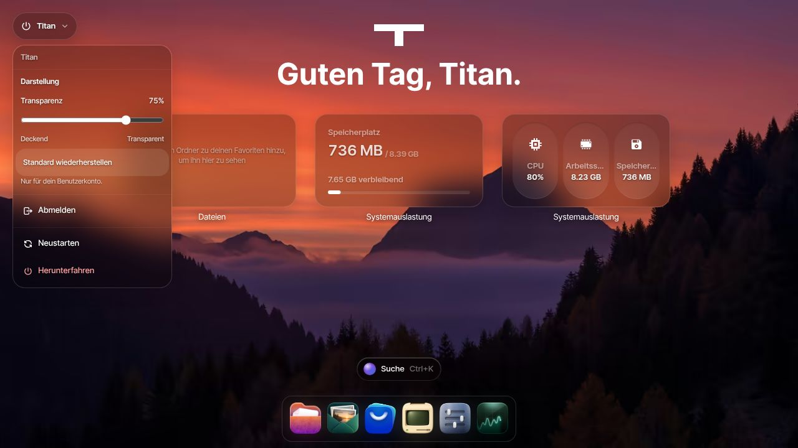
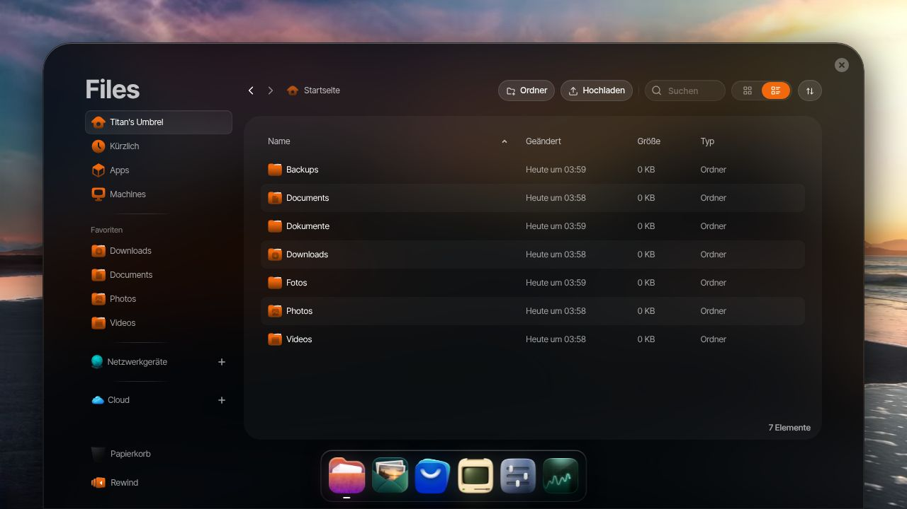
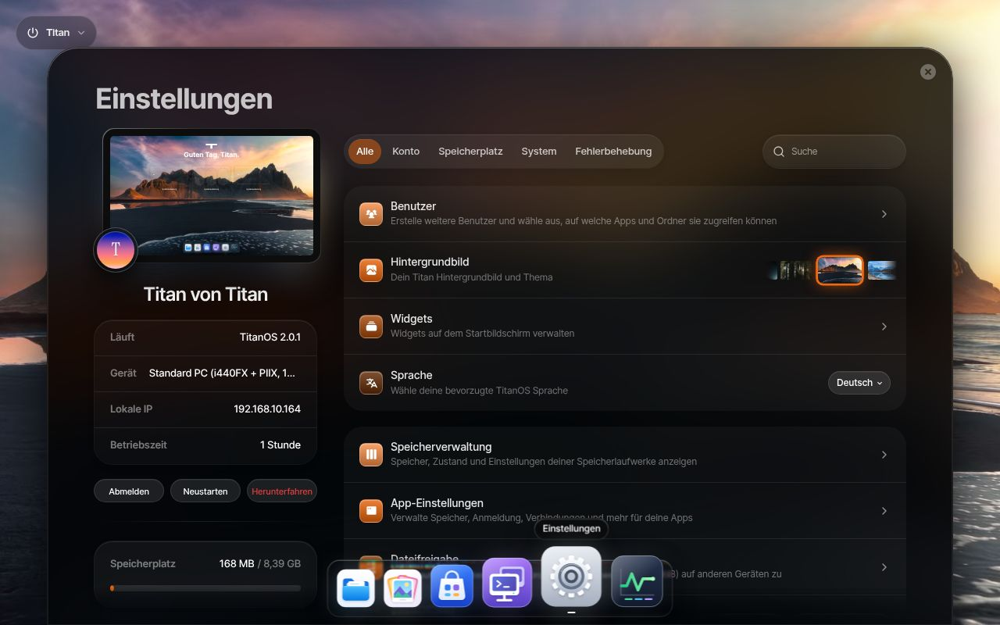

<h1 align="center">TitanOS 2.0.4 · Stable</h1>

  Ein Zuhause für deine Dateien, Apps und virtuellen Maschinen. 
  Auf deinem Server, direkt im Browser.

  <a href="https://github.com/ra5on/TitanOS/releases/download/v2.0.4/titan-2.0.4.img.xz"><strong>IMG herunterladen</strong></a>
  · <a href="https://github.com/ra5on/TitanOS/releases/tag/v2.0.4">Release &amp; Prüfsummen</a>
  · <a href="https://github.com/ra5on/TitanOS/issues">Support</a>

Das Image und das vollständige Systemupdate werden erst nach erfolgreichen
Boot- und Wiederherstellungsprüfungen veröffentlicht.

## Dein Server im Überblick

TitanOS verbindet eine deutsche Oberfläche mit einem übersichtlichen Desktop.
Im Dock erreichst du Dateien, Foto's, den App-Store, virtuelle Maschinen und
Einstellungen. Oben links findest du das Systemmenü: Abmelden, Neustarten und
Herunterfahren werden jeweils mit **Ja / Nein** bestätigt: Ja links, Nein rechts.
Unter **Darstellung** stellst du die Transparenz von Dock, Widgets und Systemmenü
ein. Die Einstellung wird für jedes Benutzerkonto getrennt gespeichert.

| Bereich | Was du damit machen kannst |
| --- | --- |
| Dateien & Foto's | Dateien verwalten und Fotos ansehen |
| App-Store & Docker | Apps installieren und Container verwalten |
| Virtuelle Maschinen | Weitere Betriebssysteme auf deinem Server betreiben |
| Speicher & Benutzer | Laufwerke einrichten und Zugänge verwalten |
| Einstellungen | Netzwerk, Backups und Systemupdates konfigurieren |

Für virtuelle Maschinen wählst du **NAT**, **Host-only** oder **Heimnetz (Bridge)**.
Fehlt eine passende Bridge, kann TitanOS sie über einen kabelgebundenen
Netzwerkanschluss automatisch einrichten. Die [VM-Netzwerkanleitung](docs/MACHINE-NETWORKS.md)
erklärt die Auswahl, den Verbindungsschutz und den Wechsel nach der Installation.
Das Dock verwendet wieder die ursprünglichen Icons des Forks.

## Ein Blick auf TitanOS

Die Desktopaufnahme zeigt TitanOS 2.0.4 mit den ursprünglichen Dock-Icons und
dem neuen Transparenzregler. Dateien und Einstellungen zeigen den dokumentierten
Stand 2.0.1. Alle Aufnahmen entstanden mit dem echten Backend in einer isolierten
Testumgebung.
[Details zu den Aufnahmen](docs/images/README.md).

| Dateien | Einstellungen |
| --- | --- |
|  |  |

## Installieren

Für einen x86-64-Rechner empfehlen wir **8 GB RAM**, eine **SSD ab 64 GB** und
**UEFI mit deaktiviertem Secure Boot**.

1. Lade [titan-2.0.4.img.xz](https://github.com/ra5on/TitanOS/releases/download/v2.0.4/titan-2.0.4.img.xz) herunter. Prüfsummen und Signatur findest du im [Release](https://github.com/ra5on/TitanOS/releases/tag/v2.0.4); die [Download-Prüfung](docs/DOWNLOADS.md) erklärt die Schritte.
2. Entpacke das Image und schreibe es mit einem geeigneten Image-Werkzeug auf die Ziel-SSD. **Dabei wird der Inhalt dieses Laufwerks überschrieben.**
3. Starte den Rechner von dieser SSD und verbinde ihn mit deinem Netzwerk.
4. Öffne `http://titan.local/` im Browser. Falls dein Netzwerk lokale Namen nicht auflöst, verwende die IP-Adresse aus deinem Router.

Das Download-Image ist kompakt. Beim ersten Start richtet TitanOS zwei
10-GiB-Systembereiche ein und nutzt die **volle verbleibende SSD-Kapazität für
deine Daten**. Apps installierst du anschließend im App-Store.

**Für eine VM:** Vergrößere die importierte **Boot-Festplatte vor dem ersten
Start auf mindestens 32 GiB, empfohlen 64 GiB**. Eine zusätzliche Datendisk
ersetzt diesen Schritt nicht. Die [VM-Anleitung](docs/VM.md) führt durch die
Einrichtung.

## Updates

TitanOS bietet ausschließlich **Stable-Systemupdates** an. Einzelne Funktionen
können ausdrücklich als Alpha oder Beta gekennzeichnet sein; stabile Funktionen
haben kein zusätzliches Badge.

Systemupdates suchst und installierst du direkt in den **Einstellungen**.
Das NAS prüft die Signatur und die Kompatibilität des vollständigen Systemupdates
vor der Installation. Nach erfolgreicher Installation startet TitanOS automatisch neu.

Unter **Software-Update & Wiederherstellung** kannst du einen verfügbaren
vorherigen Systemstand auswählen. Das fünf Sekunden sichtbare Startmenü bietet
diese Auswahl auch ohne Weboberfläche. Persönliche Dateien und App-Daten werden
bei einem Systemrollback nicht zurückgesetzt; dafür brauchst du eigene Backups.

Bestehende Installationen dieses TitanOS-Forks ab **2.0.1** erhalten die neue
Ausgabe über den eigenen TitanOS-Stable-Kanal. Der Wechsel von Titan 3.x oder
einer Installation mit früherem Namensraum benötigt eine **Neuinstallation**.
Details findest du in der [Update-Anleitung](docs/UPDATES.md).

## Gut zu wissen

Release 2.0.4 enthält einen signierten Prüfbericht. Er dokumentiert den echten
UEFI-Start, die VM-Netzwerktests sowie Update, Neustart, manuellen Rollback und
automatische Rückkehr nach einem fehlgeschlagenen Systemstart. Der
Wiederherstellungstest verwendet einen privaten älteren Teststand aus demselben
Quellcode; er ist kein Nachweis für sämtliche Datenmigrationen älterer Releases
oder jede Hardwarekombination. Details findest du in der
[Update-Anleitung](docs/UPDATES.md).

Der App-Store verwendet externe App-Quellen; Apps werden nach der Einrichtung
installiert. Google Drive, Dropbox und OneDrive benötigen eigene
OAuth-Konfigurationen. Fragen und nachvollziehbare Fehlerberichte kannst du im
[Titan-Support auf GitHub](https://github.com/ra5on/TitanOS/issues) teilen.

---

[Lizenz](LICENSE.md) · [Herkunft und Drittkomponenten](UPSTREAM.md)
