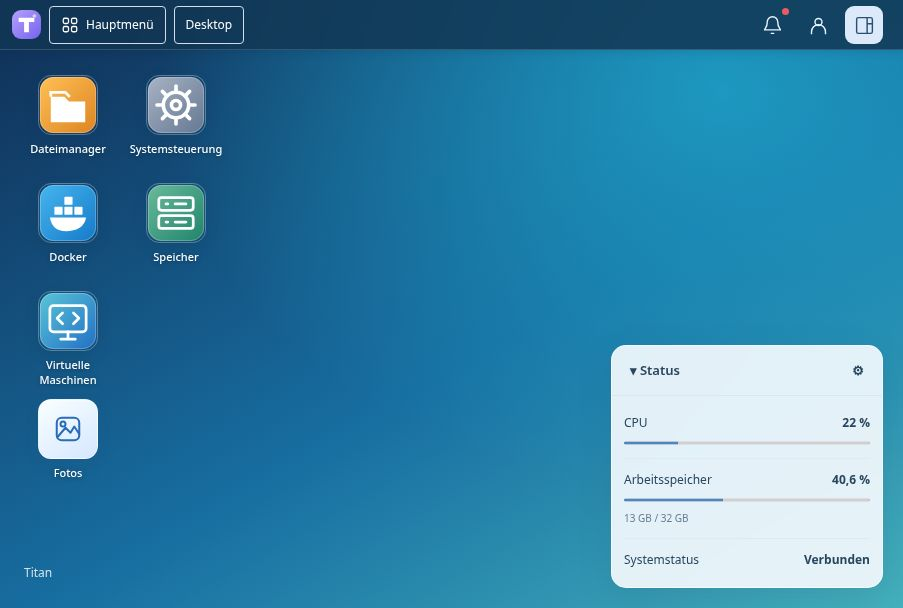
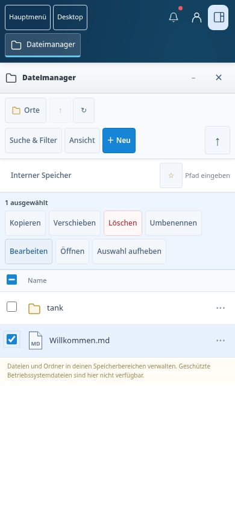
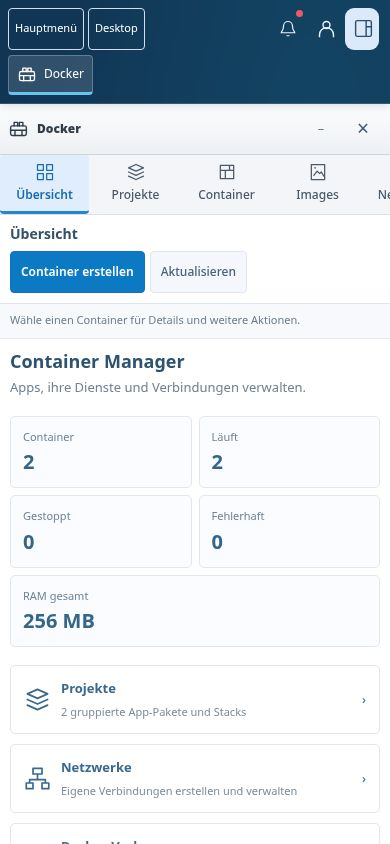
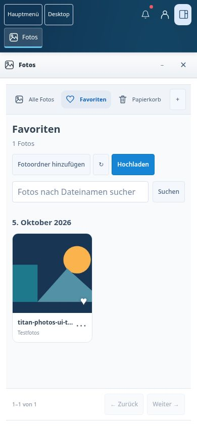
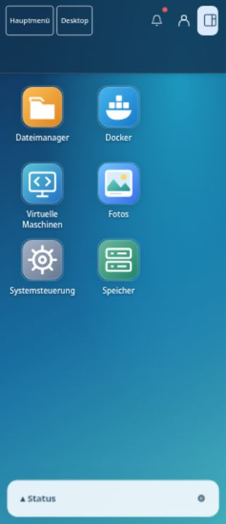

# Titan

**Deine Daten. Deine Anwendungen. Dein NAS.**

[Image 3.0.1 herunterladen](https://github.com/ra5on/TitanOS/releases/download/titan-3.0.1/titan-3.0.1-amd64.img.xz) · [Probleme melden](https://github.com/ra5on/TitanOS/issues) · [Lizenz](LICENSE)

Titan verbindet eine deutsche Desktop-Oberfläche mit einem eigenen NAS-System.
Verknüpfungen, Fenster und Statuswidgets passen sich deinem Arbeitsablauf an.
Die Oberfläche ist auch auf dem Smartphone bedienbar.

| Bereich | Möglichkeiten |
| --- | --- |
| Docker | Container und Projekte, Netzwerke, Protokolle, Ressourcen und vorbefüllte LinuxServer.io- und Big-Bear-Vorlagen |
| Dateien & Fotos | Dateiverwaltung, Vorschau und Bearbeitung, eigene Fotobibliotheken, Alben, Favoriten und Papierkorb |
| Benutzer & Speicher | Benutzerrechte, SMB-Freigaben, benannte Speicherbereiche, ext4, XFS und ZFS |
| Virtuelle Maschinen | BIOS und UEFI, ISO und vorhandene Disk-Images, CPU-Auswahl und integrierte Browserkonsole |
| System | Anmeldeschutz, Sicherungen, signierte Systemupdates und A/B-Rollback |

Vor der Docker-Installation werden Speicher, Ports und weitere Optionen angezeigt.
Nicht unterstützte Vorlagen werden ausgelassen; die Quelle zeigt deren Anzahl.
Die Anwendung behält ihre eigene Lizenz und ihre eigenen Anforderungen.

**Titan 3.0.1 ist veröffentlicht:** Boot, NAS-Funktionen, signiertes Update,
Rollback und der echte RAM-Kaltstart sind erfolgreich geprüft. Das
[Release](https://github.com/ra5on/TitanOS/releases/tag/titan-3.0.1) und alle
Downloads sind öffentlich ohne GitHub-Anmeldung erreichbar; der Updatekanal
steht auf **stable**. Weitere Praxistests auf realer Hardware und ein
mehrtägiger Dauerlauf sind noch offen.
Ergebnisse stehen im [Prüfprotokoll](docs/QA-3.0.0.md), die nächsten Schritte im
[Praxistest](docs/PRAXISTEST-3.0.0.md).

Der eigene Titan-Code darf nichtkommerziell genutzt, verändert und kostenlos
weitergegeben werden. Verkauf und andere kommerzielle Nutzung sind untersagt.
Details stehen in der [Lizenz](LICENSE); die Rechte der verwendeten
Drittkomponenten bleiben in ihren [eigenen Lizenzen](NOTICE) erhalten.
